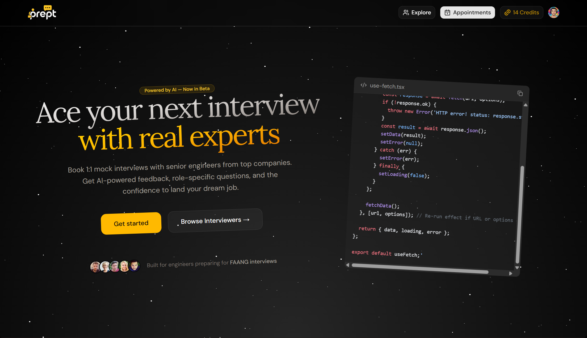
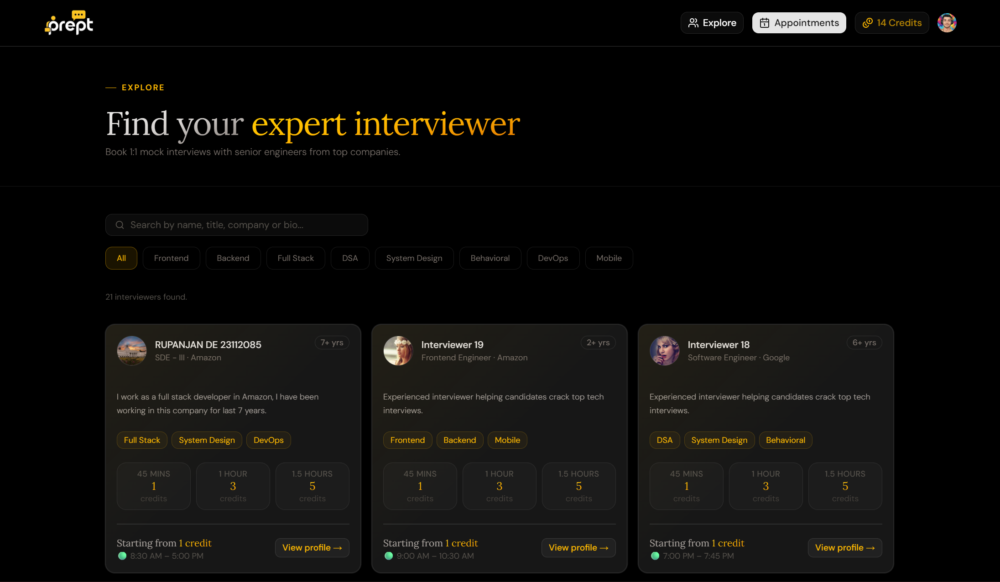
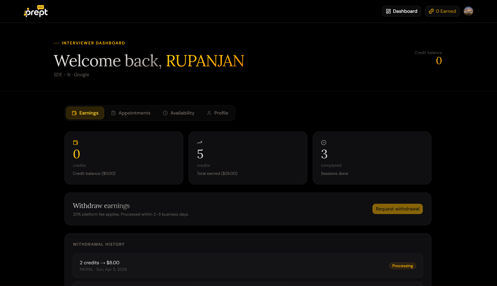
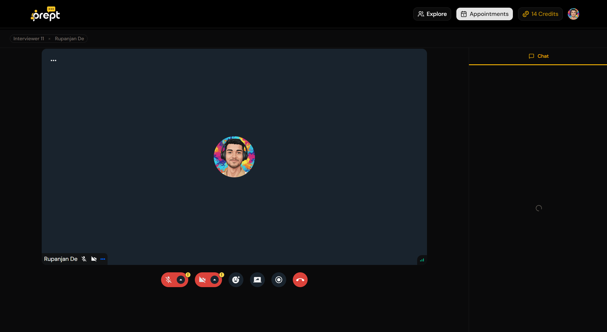
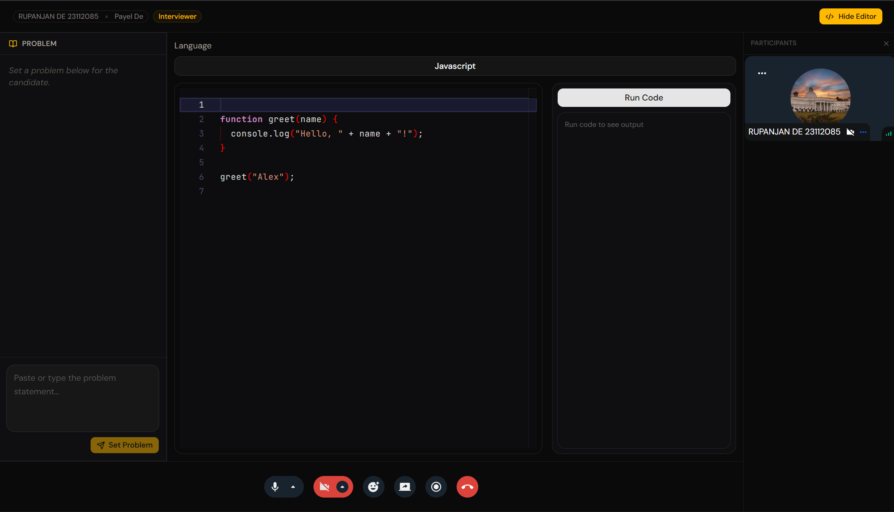

<div align="center">


### Book 1:1 mock interviews with senior engineers. Get AI-powered feedback. Land your dream job.

[](https://ai-interview-lilac-nine.vercel.app)
[](https://nextjs.org)
[](https://typescriptlang.org)
[](https://prisma.io)

</div>

---

## 📸 Screenshots

> **Landing Page**
> 

> **Explore Interviewers**
> 

> **Interviewer Dashboard**
> 

> **Live Video Call**
> 

> **Live Code Editor**
> 

---

## 🚀 Live Demo

🔗 **[https://ai-interview-lilac-nine.vercel.app](https://ai-interview-lilac-nine.vercel.app)**

Test accounts:
| Role | Email | Password |
|------|-------|----------|
| Interviewee | demo.interviewee@prept.dev | Demo@1234 |
| Interviewer | demo.interviewer@prept.dev | Demo@1234 |

> ⚠️ Demo accounts are reset periodically. Do not store sensitive data.

---

## ✨ Features

### For Interviewees
- 🔍 **Browse interviewers** by category: Frontend, Backend, System Design, PM, and more
- 📅 **Slot-based booking** — pick from available slots, confirm with one click
- 🎥 **HD video calls** powered by Stream with screen sharing
- 💬 **Persistent chat** — message your interviewer before and after the session
- 🤖 **AI feedback reports** — post-session analysis by Gemini with actionable insights
- 📹 **Session recordings** — review your performance on Pro plan
- 💳 **Credit system** — monthly credits, unused credits roll over

### For Interviewers
- 🗓️ **Set your own availability** — add/remove time slots any time
- 🤖 **AI question co-pilot** — role-specific questions generated on demand during the call
- 💰 **Earn credits per session** — withdraw earnings to your account
- 📊 **Earnings dashboard** — track sessions, credits earned, and withdrawal history

### Live Code Editor (In-call)
- 💻 **Real-time collaborative editor** — both participants see code changes instantly, synced via Stream custom events with echo-loop prevention
- 🐳 **Custom Docker execution engine** — code runs in fully isolated containers with memory, CPU, and network limits (see [Execution Server](#-execution-server))
- 🌐 **Multi-language support** — JavaScript, TypeScript, Python, Java, C++
- 🎨 **Rich VS Code-like theme** — syntax highlighting, bracket colorization, smooth cursor, JetBrains Mono font with ligatures
- 📋 **Problem panel** — interviewer sets a problem statement that syncs live to the candidate
- 🔄 **Language switching** — change language mid-session, starter code updates for both participants instantly

### Platform
- 🔒 **Security by Arcjet** — bot protection, rate limiting, abuse prevention on every route
- 📧 **Transactional emails** via Resend — booking confirmations, reminders, receipts
- 📋 **Clerk authentication** — sign in with Google, GitHub, or email
- 🏷️ **Subscription plans** — Free, Starter ($29/mo), Pro ($99/mo) via Clerk billing

---

## 🛠️ Tech Stack

| Layer | Technology |
|-------|-----------|
| **Framework** | Next.js 16 (App Router) |
| **Language** | TypeScript |
| **Database** | PostgreSQL via Prisma ORM |
| **Auth & Billing** | Clerk |
| **Video Calls** | Stream Video SDK |
| **Real-time Chat** | Stream Chat SDK |
| **Code Editor** | Monaco Editor |
| **Code Execution** | Custom Docker execution server |
| **AI Feedback** | Google Gemini API |
| **Email** | Resend + React Email |
| **Security** | Arcjet |
| **UI** | Tailwind CSS + shadcn/ui |
| **Deployment** | Vercel |

---

## 🐳 Execution Server

The live code editor runs code in **fully sandboxed Docker containers** — not a third-party API. Each submission spins up a fresh container, executes the code, captures stdout/stderr, and destroys the container automatically. This is the same architecture used by platforms like LeetCode and HackerRank.

| Protection | Detail |
|---|---|
| Network isolation | `NetworkMode: none` — zero internet access inside containers |
| Memory limit | 128MB RAM per container |
| CPU limit | 50% CPU quota |
| Timeout | 10 second limit — kills infinite loops |
| Auto cleanup | Container destroyed immediately after execution |
| API key auth | Only authenticated clients can call the server |

> 📦 **[View the Execution Server Repository →](https://github.com/lazytech614/ai-intereview-execution-server)**

The execution server is a separate Node.js + Fastify service that must be running alongside this app. See the repo for full setup and deployment instructions.

---

## 📁 Project Structure

```
├── actions/              # Next.js server actions
│   ├── ai-questions.ts
│   ├── appointments.ts
│   ├── booking.ts
│   ├── call.ts
│   ├── code.ts
│   └── dashboard.ts
│   └── explore.ts
│   └── onboarding.ts
│   └── payout.ts
│   └── user.ts
├── app/                  # App Router pages
│   ├── (main)/           # Main pages of the app
│   ├── (support)/        # Legal and support pages
│   |── error.tsx         # Fallback error page
│   |── loading.tsx       # Default loading page
│   |── not-found.tsx     # Fallback not found page
│   |── layout.tsx        # Layout
│   |── page.tsx          # Landing page
├── components/
│   ├── appointments/     # Appointment cards, feedback modal
│   ├── call/             # Video call UI, code editor, problem panel, AI questions
│   ├── dashboard/        # Earnings, availability, appointments sections
│   ├── global/           # Shared UI: page header, confirm dialog
│   └── ui/               # shadcn/ui primitives
├── emails/               # React Email templates
├── hooks/                # Custom hooks (use-fetch, etc.)
├── lib/                  # Utilities, constants, helpers
└── prisma/               # Schema and migrations
```

---

## ⚙️ Getting Started

### Prerequisites

- Node.js 18+
- PostgreSQL database (local or hosted, e.g. Supabase / Neon)
- Docker Desktop (required for the code execution server)
- Accounts for: Clerk, Stream, Google AI Studio, Resend, Arcjet

### 1. Clone the repo

```bash
git clone https://github.com/lazytech614/ai-interview.git
cd ai-interview
npm install
```

### 2. Set up environment variables

```bash
cp .env.example .env
```

See [Environment Variables](#-environment-variables) below for details on each key.

### 3. Set up the database

```bash
npx prisma migrate dev
npx prisma generate
```

### 4. Set up the execution server

The code editor requires the execution server to be running locally (or deployed). Follow the setup instructions in the **[execution server repo](https://github.com/lazytech614/ai-intereview-execution-server)**, then set `EXECUTION_SERVER_URL` and `EXECUTION_SERVER_API_KEY` in your `.env`.

### 5. Run the dev server

```bash
npm run dev
```

Open [http://localhost:3000](http://localhost:3000).

---

## 🔑 Environment Variables

Create a `.env` file in the root:

```env
# Clerk
NEXT_PUBLIC_CLERK_PUBLISHABLE_KEY="pk_test_"
CLERK_SECRET_KEY="sk_test_"

# Database
DATABASE_URL="postgresql://..."
DIRECT_URL="postgresql://..."

# Arcjet
ARCJET_KEY="ajkey_"
ARCJET_ENV="development"

# Stream
NEXT_PUBLIC_STREAM_API_KEY=""
STREAM_API_SECRET=""

# Gemini
GEMINI_API_KEY=""

# App
NEXT_PUBLIC_APP_URL="http://localhost:3000"

# Resend
RESEND_API_KEY="re_"

# Admin
ADMIN_EMAIL="demoadmin@gmail.com"
ADMIN_PAYOUT_PASSWORD="demopassword"

# Execution Server (https://github.com/lazytech614/ai-intereview-execution-server)
EXECUTION_SERVER_URL="http://localhost:3001"
EXECUTION_SERVER_API_KEY="your_secret_key"
```

---

## 🗄️ Database Schema

Key models:

```
User                — Profile, role (interviewer / interviewee), credits
Slot                — Availability slots set by interviewers
Booking             — A confirmed session linking a slot + interviewee
Feedback            — AI-generated post-session feedback tied to a booking
Message             — Chat messages between interviewer and interviewee
WithdrawalRequest   — Interviewer credit withdrawal records
```

Run `npx prisma studio` to browse your data locally.

---

## 📦 Deployment

The app is deployed on **Vercel**. To deploy your own instance:

1. Push to GitHub
2. Import the repo at [vercel.com/new](https://vercel.com/new)
3. Add all environment variables in the Vercel dashboard
4. Set `NEXT_PUBLIC_APP_URL` to your Vercel deployment URL
5. Run database migrations: `npx prisma migrate deploy`
6. Deploy the [execution server](https://github.com/lazytech614/ai-intereview-execution-server) to a VPS and update `EXECUTION_SERVER_URL` in Vercel env vars

> **Note:** The execution server requires a VPS with Docker installed (DigitalOcean, Oracle Cloud Free Tier, etc.). It cannot be deployed to Vercel or other serverless platforms.

---

## 🔮 Roadmap

- [ ] AI solo mock interview mode (no human required)
- [ ] Post-interview AI report emailed after every session
- [ ] Resume-based question generation
- [ ] Collaborative whiteboard for system design rounds
- [ ] Calendar sync (Google Calendar / iCal export)
- [ ] Referral system

---

## 🤝 Contributing

Contributions are welcome! Please open an issue first to discuss what you'd like to change.

```bash
# Create a feature branch
git checkout -b feat/your-feature-name

# Commit with conventional commits
git commit -m "feat: add calendar sync"

# Open a PR against main
```

---

<div align="center">
  <p>Made with ❤️ by <a href="https://github.com/lazytech614">Rupanjan</a></p>
  <p>
    <a href="https://ai-interview-lilac-nine.vercel.app">Live Demo</a> ·
    <a href="https://github.com/lazytech614/ai-intereview-execution-server">Execution Server</a> ·
    <a href="https://github.com/lazytech614/ai-interview/issues">Report Bug</a> ·
    <a href="https://github.com/lazytech614/ai-interview/issues">Request Feature</a>
  </p>
</div>